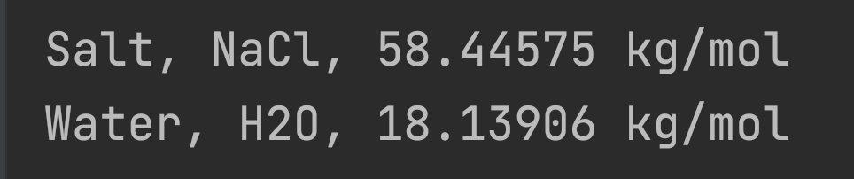

# Labs 8 and 9

****

In this lab you may choose to work independently, with a *brainstorm buddy*, or
with a partner following pair programming rules (as described in earlier labs).


Otherwise, you may only consult with:
* Your instructor or lab assistants - to clarify intent of questions if needed
  * Push code to GitLab first if it is specific question
* https://student-gitlab.pcs.cnu.edu - your personal CS250 repo's only
 * You *are* allowed to reference your prior projects
* https://web-cat.cs.vt.edu    - your webcat submissions
* Your notes and course slides

You are also encouraged to access the official Python doc pages as needed
* https://docs.python.org/3/
 * (`str`)[https://docs.python.org/3/library/stdtypes.html?highlight=str#str]
 * (`format`)[https://docs.python.org/3/library/stdtypes.html#str.format]
 * (`string` module)[https://docs.python.org/3/library/string.html]

You are *NOT* allowed to consult with anyone else, including ChatGPT (or similar) or
prior solutions to this assignment.

There are two parts to this lab, but you have seen most of Part 1 in lecture homework.
So, we expect Part 1 to be relatively quick for you to recreate using given code.

You are expected to finish Part 1 during tonights lab before you leave, and
to make good progress on the Part 2.

Part 2 is due by the end of class next week.

You must complete Part 1 to do the remaining parts correctly, although it
is possible to get some partial credit for lab9 without doing Part 1.

This lab is based on a final exam question from a few semesters ago.
It is expected that if you work diligently and design carefully you can finish
this lab during one lab period.  You have until the end of next week's lab to
complete the entire thing for full credit.

This is a challenging lab, so think carefully about your ``is-a`` and ``has-a`` relationships.
I suggest you brainstorm a design for the entire project before starting on any
one part.  Read through this entire README before starting.


___If you get stuck, ask your instructor or lab assistant for clarification;
don't just sit there "spinning your wheels" without making progress.___


# Problem

You are given six text data files:
 * small_elements.csv
 * small_molecules.csv
 * big_elements.csv
 * big_molecules.csv
 * full_elements.csv
 * full_molecules.csv

The ``small`` files contain less data and simpler format and are useful for initial testing.
The ``big`` files contain most data, but is still using simpler format.
The ``full`` files contain all data, *including some invalid lines*; tackle this one last.

Write your code so that it only requires changing one or two lines of code to switch which files are being used.
(As we did for `get_elements.py` and `separate_types.py`)

# Original data from
* https://byjus.com/chemical-compound-formulas/
* https://gist.github.com/GoodmanSciences/c2dd862cd38f21b0ad36b8f96b4bf1ee


## Part 1 Elements by Type


This is based on part of homework during Week 6, so you have seen this.

```
Hydrogen,H,1,0,1,Nonmetal
Sodium,Na,11,12,11,Metal
```

One thing to think carefully about is the question of
element type (`Nonmetal`, `Metal`, `Metalloid`).

Does an element have a type, or is it a type?

> Question: How would different answers to this question change your design?

I have given you an `Element` class (`given/element.py`) that does NOT have a `type` attribute.

You need to use my `element.py` class without modification to solve the rest of this lab.

Try not to get too bogged down in Part 1; most of the work for lab is in Part 2.

If you have questions, talk to your instructor or lab assistant sooner
rather than later.

The `*_elements` files contain information about the atomic structure of atoms of various elements.
The data is given as a commma (',') delimited CSV file with the following data on each line

<pre>
{name},{symbol},{num_protons},{num_neutrons},{num_electrons},{type}
</pre>

Where `type` is either `Nonmetal`, `Metal`, or `Metalloid`.

I have given you code in `given/element.py`
You are *NOT* allowed to modify this code.

There is also `given/separate_types.py`
You are *NOT* allowed to modify this code.

Unfortunately, `separate_types.py` does not work right now.

You are only allowed to modify code in `src/get_elements.py` to fix it so that `separate_types` works correctly!

You are allowed to introduce new class definitions as needed (and new files if you wish).
> Hint 1: You should! But then you will need to fix `load_element_data` to construct the proper types

> Hint 2: You might find it convenient to create a dictionary from type name to class definition,
> and then you can look up the class definition required to create the instance.
> For only 3 types you can use `if-elif-else`, but for a large number of types that will get
> cumbersome.  If this hint does not make sense, then start with `if-elif-else` to get working,
> then ask the lab assistant for help.  I will be asking you to do it this way eventually.

You will then need to modify the `get_metals`, `get_nonmetals`, `get_metalloids`
methods to take a list of arbitrary objects that "is-a" `Element` and return only the specific types.

> Hint 3: In the `barnyard` HW problem, we needed to separate instances of `Rooster` from
> a list of `animals`.  You need to do something similar here.

If you do it correctly, the output of  running `given/separate_types.py` using `small_elements.csv` should look like:
<pre>
---- Non-metals ----
H, Hydrogen, 1.0080 kg/mol
O, Oxygen, 16.1231 kg/mol
Cl, Chlorine, 35.2690 kg/mol
---- Metals ----
Na, Sodium, 23.1767 kg/mol
---- Metalloids ----
Te, Tellurium, 128.9784 kg/mol
</pre>

The code should work for any of the possible files.
Comment/uncomment lines in `src/get_elements.py` to select the file.
<pre>
# Change this to choose which file to load
# Using ALL_CAPS style because treated as a constant
ELEMENT_FILE_PATH = os.path.join("data", "small_elements.csv")
#ELEMENT_FILE_PATH = os.path.join("data", "big_elements.csv")
#ELEMENT_FILE_PATH = os.path.join("data", "full_elements.csv")
</pre>

A suggested approach is to define three `Metal`, `Metalloid`, and `Nonmetal` classes that inherit from `Element`.  Doing this correctly will simplify your life.

> Hint: You should do it this way!

* Do a commit and push to GitLab

Modify `load_element_data` to add an `element_type_dictionary` that maps name to
the class definition.  That is, given the string 'Metal' as a key, your dictionary should
return the class definition for `Metal`.  
> Note: Return the *definition* of class, not an instance of the class!
> This was Hint 2 above.  I want you to get this working.  Ask for help if you
> need this clarified.  I have given you an example in the `given/demo_dict.py` script.

Modify `load_element_data` method to create instances of the proper type.
That is, given a type string, retrieve the appropriate class definition, and
use to construct an instance by using parenthesis and relevant arguments.
(Seriously, look at the `given/demo_dict.py` script!)


* Do a commit and push to GitLab

Test by running both `src/get_elements.py` and `given/separate_types.py`

> NOTE: Do NOT modify any of the code in the `given` folder to make this work!

*Be sure to push to Gitlab at this point (if you have not already done so)!*

Notify your instructor when you have completed, tested, and pushed Part 1.

On Scholar, submit screen shot of the latter portion of `separate_types.py` output
from `full_elements.csv` data.
(Whatever reasonably fits on output screen)

We expect this to take less than 1 hour for Part 1, so if you are stuck ask for help early.

## Part 2 - Molecules

This is the primary focus of Lab, and will require some design effort on your part.

The `*_molecules` has a comma (',') delimited CSV file with the molecule name, chemical symbol,
followed by a breakout of constituent elements and number.  So that common water (H2O) is
shown as:

<pre>
Water,H2O,H,2,O,1
</pre>

A more complicated molecule such as Sodium Percarbonate would be

<pre>
Sodium Percarbonate,C2H6Na4O12,C,2,H,6,Na,4,O,12
</pre>

>NOTE: The number of elements in each line of the `big_` and `full_` molecule files varies!

> Hint: A slice of a list might help you out here.

The `small_molecules` files contain only 2 element molecules such as H2O so that  
the number of elements on each line is fixed. Use it to get started coding incrementally,
then adapt to the variable numbers of elements.

The `full_molecules` file contains some lines that are invalid.

These lines are marked with a `#` at the beginning.

For full credit, your code must process the `full` file and ignore comment lines  
beginning with `#` without crashing, or make use of Exceptions (covered in class lecture this week)
You should print a reasonable message saying why the line was skipped.

>HINT: Code incrementally and begin by writing the single class and get file IO working,
then work on getting the individual inherited classes.

  This depends on `src/get_elements.py` working correctly!
  So focus your efforts there first.

  You can get partial credit by reading the second file and getting some data even
  if the calculations are not strictly correct.

Read all of the steps before beginning.  

Latter steps will depend on how you do earlier steps, so start by reading all
steps below, *think*, design, then start coding step-by-step.

Part 1 was scaffolded", constrained, and directed.  Part 2 is deliberately open ended.

*"This is the job!"*

Folks pay well for people who can problem solve.
This lab is intended for you to practice your design and problem solving skills.

For these I define a partial design and specify some minimum commit points;
if you are working on a particular section, you are free (read "encouraged"!) to
make multiple commits during any particular numbered section, but be sure to
make final commit before moving on to the next numbered part.

Inside `src/lab8.py`

1. Load elements into `lab8.py` main function

  Load the appropriate `elements` file using your code from `get_elements.py`.

  *Do a commit and push.*

  Print data to screen element by element to confirm working

  *Do a commit and push.*

  Comment out the print loop as you don't need anymore

  Do not overthink this part, it should be easy.

2. Modify to sort elements list first and then print

  *Do a commit and push.*

  Comment out the print loop as you don't need anymore

  Again, do not overthink this part, it should be easy.

3. Create Molecule class

  Create a *new* class to hold the molecule data that you will load from second file.
  You may choose to define the class inside the `lab8.py` file, or create a separate file
  in the `src` folder.

  Creating a separate file is better style, but make sure you *`git add src`* to have
  Git track this file.

  Define a private class attribute variable to hold an atom symbol lookup dictionary for later use
  as prompted in the `lab8.py` comments.

  Set this dictionary variable equal to `None` or an empty dictionary for now
  (it's just a place holder ).

  *Do a commit and push.*


  Define the init method and initialize whatever attributes you think you need to
  store from file

  > HINT:  You should be looking at the molecule data file, and think about
  > what information you will be passing in when you read the file and in
  > what form!  Think about "is-a" and "has-a".


  *Do a commit and push.*


4. write `read_molecule_data` in `src/lab8.py`

  Read a `molecules` file from `data` folder, and if the line is valid,
  print data from file, otherwise if comment line (`#`) print relevant message
  (This is coding incrementally!)

  *Do a commit and push.*

  Given valid data from line, create a `Molecule` instance that holds relevant data.

  > NOTE: Again, you should already have a design for how to pass relevant data
  > given that number of elements may vary on a line


  Append Molecule instance to list of molecules

  Then return the list of molecules from `read_molecule_data`

  *Do a commit and push.*

5. Print list of molecules unsorted by string

  The string should look bad at this point, but just be sure you're returning a list
  of molecules

  *Do a commit and push.*


6. Add a dummy `get_molecular_mass()` method to your `Molecule` class

  Have it return -1 for now

  *Do a commit and push.*


7. Add a `__str__` method  to `Molecule`

  Print the name, symbol, and molecular mass (use 5 decimal digits) of entire molecule.
  (For now, it will just print the dummy -1 value from `get_molecular_mass()`)

  Re-run the `lab8.py` and verify your print is working for now.

  *Do a commit and push.*

8.  Add a method to Molecule that lets you sort the molecule list before printing
    each instance.  Here we want to sort using *alphabetic* order by name (not symbol!).

    Add method, then *Do a commit and push.*

    Add sort of list before print, test, and   

    *Do a commit and push to Gitlab.*


9. Inside `lab8.py` main, create an element dictionary to look up instance by symbol .

    Convert the list of element data into a dictionary where the element symbol is the key, and
    class instance is the value. (To enable later look up by symbol)

    Use the Element data you read in step 1 above.
    *Do a commit and push.*

    Set the private class attribute (originally set to None) of Molecule to reference this dictionary
    (Think about how to access the private class attribute from the `lab8.py` main method.)

    *Do a commit and push.*


  10. Calculate the molecular mass of a molecule

  The molecule instance needs `get_molecular_mass()` method that calculates the
  total mass of molecule using count of each elemental atom.
  So, for example `H2O` would calculate total mass as 2 * atomic mass of Hydrogen + 1 * atomic mass of Oxygen.
  You decide how to store the data in molecule, but get the element atomic mass data from the
  element instance for each element (using your dictionary stored as class attribute!)

  > NOTE:  This is a simplified calculation as we are ignoring shared electrons in chemical bonds.
  > This is not strictly negligible, but the difference in total molecular mass is small
  > enough for our purposes.


  *Do a commit and push.*

  Feel free to do multiple commits while you're working on this.


11. Sort and print

  Sort the list of molecules alphabetically, and print the name, symbol, and
  molecular mass of entire molecule list from file.

  Take a screenshot of a portion of the output for each data file.

  *Do a commit and push.*

  Here is my output using the `small` files :

  


# Bonus (+5 points to lowest lab grade)

If you have time, add code to `lab8.py` to save the sorted molecule
data (name, symbol, and molecular mass) to a CSV file stored in `data/` folder.

Upload this `csv` file to scholar with images for grade.

>NOTE: Make sure you `git add .` to commit any new src files!


## Grading for Lab8
  * 30 points: Screen shot of separate_types output (due within 3 days of tonight)
  * 20 points: Git commit history shows relevant commit messages and incremental coding
  * 20 points: PyLint style points (will defer scoring until lab8 is complete)
  * 30 points: Good effort during first lab period towards completing lab9.

## Grading for lab9
  * 10 points: Screen shot of separate_types output
  * 10 points: Screen shot of small_molecules print in Scholar
  * 10 points: Screen shot of big_molecules print in Scholar
  * 10 points: Screen shot of full_molecules print in Scholar
  * 10 points: Git commit history shows relevant commit messages and incremental coding
  * 20 points: PyLint style points
  * 10 points: Instructor code review
  * 20 points: Good effort during lab period towards completing this lab.

> Note: There will be an additional mini-lab 9 next week in addition to this work, so
> you still need to show up even if you finish all of this!

If you do not complete during lab, you are expected to complete independently or with the
help of your pair programming partner, which continuing to follow all pair programming rules.  

Submission of screenshots claims academic credit and honor code following this requirement.  

Notify your instructor when you complete the lab and show screenshots before leaving the lab.

> Note: This lab combines major skills in file input/output (IO), classes including
> inheritance, and problem solving.  This lab was based on the programming portion
> of a final exam a few years ago.  The expectation is that this is solvable in about
> two hours of steady work (after you have practiced for the entire semester, so
> your milemage may vary this week).


*****

Copyright 2025 Christopher Newport University.

All rights reserved.

For the private use of CNU students currently enrolled in CPSC 250L.
Not for posting on any site other than internal `student-gitlab.pcs` server.
