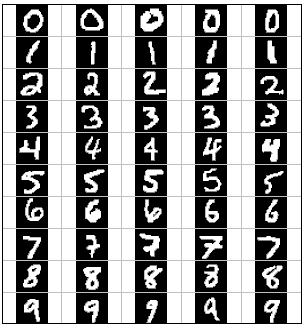

## Project 7: Neural Net Classification
### Table of Contents

> NOTE: On some windows systems, Git is treating the pkl file like a
> text file and updating the CRLF vs. LF encoding.
>
> If you are getting an error loading Pickle files,
> change into the "pacmandata" folder and run "fix_pkl.py" script

This project will re-do Project 6 with more modern frameworks.

This README provides instructions for using Keras and TensorFlow.

Follow the `Setup` instructions below to set up a Python virtual environment to install
the required packages.

There is a separate  `main-pytorch` branch that has the set up directions for using PyTorch instead
of Keras/Tensorflow.

For P7 grade, you only need to do one approach, either Keras/TensorFlow or PyTorch, but you are
encouraged to look at the code for both.

----

 *   [Introduction](#Introduction)
 *   [Q1: Neural Nets](#Q1)
 *   [Q2: Behavioral Cloning](#Q2)
 *   [Q3: Pacman Feature Design](#Q3)

* * *

 ||
 ------|-----|
 Which Digit? | Which action? |

### Introduction

In this project, you will design two neural network classifiers.
You will test the first classifier on a set of scanned handwritten digit images, and the second
 on sets of recorded  pacman games from various agents.
Even with simple features, your classifiers will be able to do quite well on these tasks when given enough training data.

Optical character recognition ([OCR](http://en.wikipedia.org/wiki/Optical_character_recognition
)) is the task of extracting text from image sources.
The data set on which you will run your classifiers is a collection of handwritten numerical
 digits (0-9).
This is a very commercially useful technology, similar to the technique used by the US post
 office to route mail by zip codes.
There are systems that can perform with over 99% classification accuracy
 (see [LeNet-5](http://yann.lecun.com/exdb/lenet/index.html) for an example system in action).

Behavioral cloning is the task of learning to copy a behavior simply by observing examples of
 that behavior. In this project, you will be using this idea to mimic various pacman agents by
  using recorded games as training examples. Your agent will then run the classifier at each
   action in order to try and determine which action would be taken by the observed agent.

The code for this project includes the following files and data, which is available in this
 repository.

<table class="intro" border="0" cellpadding="10">

<tbody>

<tr>

<td colspan="2"> <h4>Data file</h4> </td>

</tr>

<tr>

<td>`data.zip`</td>
<td>Data file, including the digit and face data.</td>

</tr>

<tr>

<td colspan="2"> <h4>Files you will edit</h4> </td>

</tr>

<tr>

<td>`neural_net_pacman.py`</td>

<td>The location where you will write your behavioral cloning perceptron classifier.</td>

</tr>

<tr>

<td>`neural_net.py`</td>

<td>The location where you will write your perceptron classifier.</td>

</tr>

</table>

***

**Files to Edit and Submit:** You will fill in portions of `neural_network.py
`, `neural_network_pacman.py` during the assignment, and submit them. You should submit
 these files with your code and comments. Please _do not_ change the other files in this
  distribution or submit any of our original files other than this file.

**Evaluation:** Your code will be autograded for technical correctness. Please _do not_ change
 the names of any provided functions or classes within the code, or you will wreak havoc on the
  autograder. However, the correctness of your implementation -- not the autograder's judgements
   -- will be the final judge of your score. If necessary, we will review and grade assignments
    individually to ensure that you receive due credit for your work.

**Academic Dishonesty:** We will be checking your code against other submissions in the class
 for logical redundancy. If you copy someone else's code and submit it with minor changes, we
  will know. These cheat detectors are quite hard to fool, so please don't try. We trust you all
   to submit your own work only; _please_ don't let us down. If you do, we will pursue the
    strongest consequences available to us.

**Getting Help:** You are not alone! If you find yourself stuck on something, contact the course
 staff for help. Office hours, section, and the discussion forum are there for your support
 ; please use them. If you can't make our office hours, let us know and we will schedule more
 . We want these projects to be rewarding and instructional, not frustrating and demoralizing
 . But, we don't know when or how to help unless you ask.

**Discussion:** Please be careful not to post spoilers.

* * *

### Setup
Before anything install the required modules in a virtual environment.

Change to the present working directory and create a fresh virtual environment if needed.

`python3 -m venv venv`, then activate before each run `source venv/bin/activate`

For TensorFlow, with Nvidia GPU, `pip3 install -r tf_requirements_cuda.txt`.
Otherwise, for CPU only use, `pip install -r tf_requirements.txt`

Use `export TF_CPP_MIN_LOG_LEVEL=2   # 2=WARNING, 3=ERROR` to reduce console spam from TensorFlow.

### Question 1 (5 points): Neural Network

Before anything install the required modules in a virtual environment.

A neural network is already implemented for you in `neural_net.py`.
Your job is to experiment and find the best combination of hidden layers and parameters for the
 classification of test inputs.
In this case, you will be making a classifier for recognizing hand written digits.

#### Add hidden layers
In the `make_model` function you are free to add as many hidden layers as you desire.
However the final layer must have the `units` parameter equal to the outputs parameter passed
 into the function.

You can add a hidden layer by calling `model.add(Dense())` and passing in `units` and `activation`.
This is already done once for you, so you may just copy and paste.

At the top of the module is a constant named `PRINT` if you set this to `True` you can see the
 progress of your neural networks training should you desire.
This will also report helpful values such as the loss at the end of every epoch.

#### Edit these parameters

In `__init__()`
* self.max_iterations: To adjust the number of epochs for training.
  * More than 1 less than 1000 (larger numbers take longer, and might overtrain)

In `make_model()`

In the `model.add(Dense())` call.
* units: To change the number of perceptrons in a hidden layer.
  * Try more than 1, less the 1024
* activation: To change the activation function for the hidden layer.
  * At a minimum, try 'linear', 'relu', and 'softmax' (for output)
In the `model.compile()` call.
* optimizer: To change the type of stochastic gradient descent applied to the network.
  * List of optimizers: https://keras.io/api/optimizers/#available-optimizers
  * At a minimum, try 'sgd' and 'adam'
* loss: To change the loss function.

You can find the various parameters available to you in Keras with links provided in the code.

Run your code with: `python autograder.py -q q1`

**Hints and observations:**

* Don't make the neural network too big.
It will most likely under perform and take a while to train.
Experiment and find a good balance.

* * *

### Question 2 (4 points): Behavioral Cloning

In this question, you will do the same as you did in Q1 except in `neural_net_pacman.py`.

Instead of classifying digits, you will be classifying moves for a pacman agent.

Run your code with: `python autograder.py -q q2`

* * *

### Question 3 (5 points): Behavioral Cloning +

Q3 uses the same model from Q2 in `neural_net_pacman.py`.
However, you are now given more information about the pacman world in your input.

You should expect this classifier to outperform the one from Q2.

Run your code with: `python autograder.py -q q3`

* * *

### Submission

You're not done yet! Submit your code to your gitlab fork of this project.

If you are working in a group, make sure you do a final fork to your personal group.
